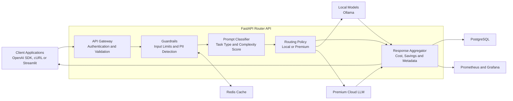

# Local SLM Router API

A smart AI routing API that automatically sends each prompt to either a local Small Language Model or a premium cloud model based on its complexity.

Simple prompts are handled locally through Ollama to reduce cloud costs, while more complex prompts are sent to a premium cloud model for better results.

Every response explains:

- Which model answered the request
- Whether it was processed locally or in the cloud
- The prompt's complexity score
- Why the model was selected
- Estimated cost and savings
- Whether a fallback or cache was used

> **Project Status:** Work in progress

## Architecture

## How It Works

1. A client sends a prompt using the OpenAI-compatible API.
2. The API validates the request and checks for sensitive information.
3. The prompt is classified and given a complexity score between `0` and `100`.
4. Prompts scoring below `30` are routed to a local model.
5. Prompts scoring `30` or higher are routed to a premium cloud model.
6. If a local model fails, the request can fall back to the cloud.
7. The response includes the routing decision, model, score, cost and estimated savings.

## Technology Stack

- Python
- FastAPI
- Ollama
- PostgreSQL
- Redis
- Prometheus
- Grafana
- Streamlit
- Docker Compose
- Pytest
- Ruff

## Planned Local Models

- Phi-3 Mini for basic questions and conversations
- Mistral 7B for summaries, translations and rewriting
- Llama 3.1 8B for general local requests

## Planned Features

- OpenAI-compatible chat completion endpoint
- Automatic local or premium routing
- Explainable complexity scoring
- Privacy-first routing
- Local-to-cloud fallback
- Exact-match response caching
- Cost and savings tracking
- Prometheus metrics
- Grafana dashboard
- Streamlit playground
- Router evaluation and optimisation

## Project Goal

The goal of this project is to demonstrate how local and cloud AI models can work together to reduce estimated cloud costs while maintaining response quality, reliability and transparency.

## Current Status

This project is currently under development. Setup instructions, evaluation results, screenshots and a full demonstration will be added as each development phase is completed.