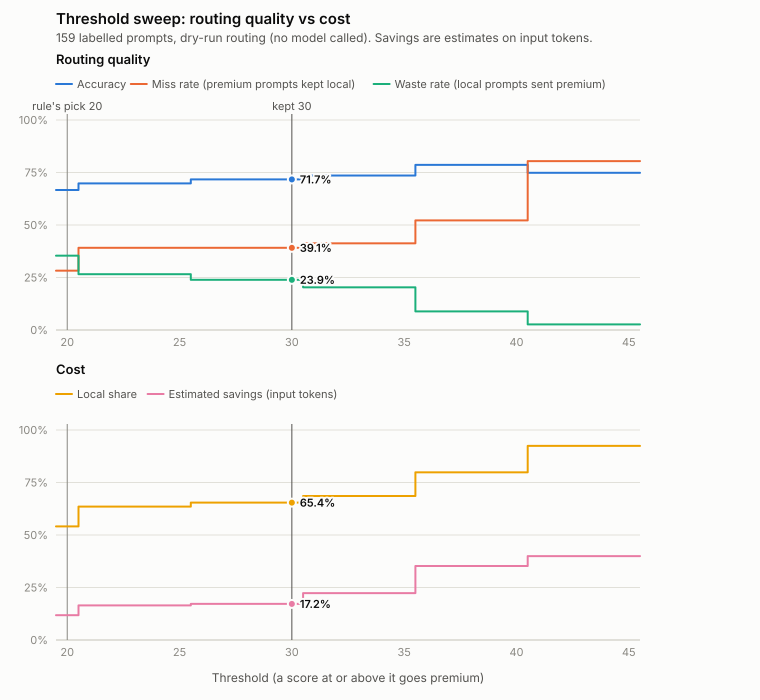

# Evaluation results

Evaluated 2026-10-01 at version `803417e-dirty`, dataset `eval/prompts.jsonl` (sha256 `69e43184ce91`). Generated by `make eval-report` from `eval/results/`; do not edit by hand.

| Part | Status |
| --- | --- |
| Router evaluation (dry run, 159 prompts) | **Done.** Deterministic; no model called |
| Threshold sweep 20-45 | **Done.** |
| Answer-quality check (premium grades local answers) | **Pending.** Needs real local models and a premium key (`make eval-quality-paid`) |
| Latency (p95 per tier) | **Pending.** Measured by the quality run |

No answer-quality, latency or USD savings figure is claimed below unless its row above says done. Savings are estimates.

## Headline

At the threshold in `config/routing.yaml` (**30**):

| Metric | Value |
| --- | --- |
| Router accuracy | 71.7% (114 of 159) |
| Under-routed (premium prompt sent local) | 18 prompts: 11.3% of all, **39.1% of premium-labelled prompts** |
| Over-routed (local prompt sent premium) | 27 prompts: 17.0% of all, 23.9% of local-labelled prompts |
| Local share | 65.4% |
| Estimated savings vs all-premium (input tokens) | 17.2% |
| Answer quality (local judged same or better) | pending |
| p95 latency local / premium | pending |

Under-routing is the weak spot: the router keeps 39.1% of the prompts that need the premium model on a local model. 13 of those 18 score below 20, so no threshold in the sweep reaches them; 11 of the 18 were given the wrong task type by the keyword classifier. The fix is the classifier, not the threshold (see Errors).

## Dataset

159 hand-written prompts in `eval/prompts.jsonl`: 113 labelled local and 46 premium, 62 marked borderline. Every row has an id, the task, the expected tier, a rationale and tags; `make eval-validate` checks the schema, unique ids, labels, distribution, duplicates, secrets and that any personal data is synthetic (example.com, 555-01xx numbers, published test cards).

| Task | Prompts | Local | Premium | Borderline | Quality subset |
| --- | --- | --- | --- | --- | --- |
| chitchat | 12 | 12 | 0 | 1 | 2 |
| qa | 17 | 14 | 3 | 5 | 5 |
| rewrite | 14 | 13 | 1 | 6 | 4 |
| summarise | 15 | 12 | 3 | 4 | 5 |
| translate | 12 | 9 | 3 | 6 | 4 |
| extract | 15 | 12 | 3 | 4 | 5 |
| creative | 15 | 11 | 4 | 6 | 5 |
| code | 21 | 12 | 9 | 10 | 6 |
| math | 17 | 8 | 9 | 11 | 5 |
| analysis | 21 | 10 | 11 | 9 | 5 |

Edge cases (rows can carry several tags): borderline 62, code block 12, context window 2, deep conversation 5, implicit task 25, long input 12, multi part 21, obvious local 30, obvious premium 9, output demand 7, override 3, privacy 5, reasoning cue 17, system prompt 2.

**How labels were set.** `local` means a 7-8B local model (Phi-3 Mini, Mistral 7B, Llama 3.1 8B) would likely answer adequately; `premium` means a small model would likely be noticeably worse: multi-step reasoning, non-trivial code, judgement-heavy analysis, long high-quality output or precise language work. Rows decided by a hard rule carry the tier the policy must give (context window: premium; privacy: local; override: the forced tier). Labels were written before the router was run on the set and were not changed afterwards. They are one person's judgement, not ground truth, and several prompts deliberately avoid the classifier's keywords.

## Method

- Each prompt is routed in-process by the same `Router` that serves `POST /v1/route` (a test checks they agree), with `config/routing.yaml` as committed. No model is called, so the run is free and deterministic.
- Rows marked `privacy_mode` are routed with privacy mode on; rows with `forced_tier` send it as `X-Router-Tier`.
- The sweep re-routes every prompt at each threshold from 20 to 45; every other weight is unchanged.
- Savings are estimated against the premium default model (the configured baseline, `premium-default`), not a flagship. A dry run has no answers, so only input tokens are priced: premium prices are not configured, so this is the share of input tokens kept local, which equals the input-cost saving because local models cost 0 and the baseline's input price cancels out.

**Definitions.** *Under-routed*: labelled premium, routed local (the answer may be worse). *Over-routed*: labelled local, routed premium (only costs money). Accuracy + under-routed % + over-routed % = 100. *Miss rate*: under-routed / premium-labelled prompts. *Waste rate*: over-routed / local-labelled prompts. *Local share*: prompts routed local / all. *Savings %*: (baseline cost - routed cost) / baseline cost.

## Threshold sweep

Every base score and modifier is a multiple of 5, so routing only changes between plateaus; thresholds on one row route all 159 prompts identically. Per-threshold numbers are in `eval/results/sweep.json`.

| Threshold | Accuracy | Under-routed | Miss rate | Over-routed | Waste rate | Local share | Premium share | Est. savings | Within one step |
| --- | --- | --- | --- | --- | --- | --- | --- | --- | --- |
| 20 (rule) | 66.7% | 13 | 28.3% | 40 | 35.4% | 54.1% | 45.9% | 11.8% | 44 |
| 21-25 | 69.8% | 18 | 39.1% | 30 | 26.6% | 63.5% | 36.5% | 16.5% | 18 |
| 26-30 **(kept)** | 71.7% | 18 | 39.1% | 27 | 23.9% | 65.4% | 34.6% | 17.2% | 9 |
| 31-35 | 73.6% | 19 | 41.3% | 23 | 20.4% | 68.5% | 31.4% | 22.3% | 24 |
| 36-40 | 78.6% | 24 | 52.2% | 10 | 8.8% | 79.9% | 20.1% | 35.2% | 41 |
| 41-45 | 74.8% | 37 | 80.4% | 3 | 2.6% | 92.5% | 7.5% | 39.9% | 29 |

*Within one step*: prompts scoring between threshold - 5 and the threshold, which one modifier more or less would flip. Fewer is more stable.



## Selected threshold

**Previous 30, selected 30.** Keep 30. The automated rule's pick (20) is overridden; see reasons.

The automated rule (`select_threshold` in `eval/metrics.py`, fixed before the first sweep) treats under-routing as a hard limit: a threshold is eligible only if its miss rate is within 5 points of the sweep's lowest; among those it takes the fewest weighted errors (2 x under + over), then higher savings, then stability. Its output:

- Lowest miss rate in the sweep: 28.3% of premium prompts; eligible thresholds keep it at or below 33.3% (+5 percentage points).
- Eligible: 20.
- Fewest weighted errors (2 x under + over) among them: 66 at threshold 20 (13 under-routed, 40 over-routed).
- Thresholds 20-20 route every prompt identically; 20 is reported for that plateau.

At the rule's pick (20) versus 30: miss rate 28.3% vs 39.1%, over-routed 40 vs 27, local share 54.1% vs 65.4%, estimated savings 11.8% vs 17.2%, weighted errors 66 vs 63.

Why (from `eval/decision.yaml`, decided 2026-10-01):

- Under-routing is the priority, but 20 buys little of it: it catches 5 more of the 46 premium prompts (miss rate 39.1% -> 28.3%) by sending 13 more local prompts to premium, cutting the local share from 65.4% to 54.1% and estimated savings from 17.2% to 11.8%.
- Even with under-routing weighted double, 30 has fewer weighted errors than 20 (63 vs 66). The rule only chose 20 because its hard miss-rate ceiling (lowest + 5 points) admits no other plateau: each 5-point step moves several prompts at once, so the ceiling was stricter than intended. That is a flaw in the rule's tolerance, recorded here rather than tuned away after the fact.
- Stability: 44 prompts score within one 5-point step of 20 (scores 15 and 20), against 9 for 30, the fewest of any plateau. At 20 a single +5 modifier moves any summarise, translate or extract prompt to premium, and every creative prompt (base 20) goes premium, including a haiku and the design doc's own local example ("summarise this 600-word article", score 20).
- Most under-routing is not a threshold problem: 13 of the 18 under-routed prompts at 30 score 15 or less, so no threshold from 20 to 45 reaches them. 8 of those 13 get the wrong task type from the keyword classifier (math puzzles and creative forms read as qa); the other 5 are hard examples of low-scoring tasks (legal paraphrase, precise or literary translation, exact arithmetic over many items). The next lever is the classifier and scoring, measured on held-out prompts.
- 40 has the best accuracy (78.6%) and savings (35.2%) but keeps 52.2% of premium prompts local; it is rejected for under-routing, not chosen for accuracy.

Revisit when: The classifier changes, the dataset changes, or the paid quality check shows that local answers for prompts scoring 20-25 are worse than premium ones.

## Errors

At threshold 30. Confusion (rows: labelled tier, columns: routed tier):

|  | Routed local | Routed premium |
| --- | --- | --- |
| Labelled local | 86 | 27 |
| Labelled premium | 18 | 28 |

| Task | Prompts | Accuracy | Under-routed | Over-routed |
| --- | --- | --- | --- | --- |
| chitchat | 12 | 100.0% | 0 | 0 |
| qa | 17 | 76.5% | 2 | 2 |
| rewrite | 14 | 85.7% | 1 | 1 |
| summarise | 15 | 73.3% | 0 | 4 |
| translate | 12 | 66.7% | 3 | 1 |
| extract | 15 | 86.7% | 1 | 1 |
| creative | 15 | 66.7% | 4 | 1 |
| code | 21 | 52.4% | 1 | 9 |
| math | 17 | 47.1% | 5 | 4 |
| analysis | 21 | 76.2% | 1 | 4 |

Decided by the threshold: 71.0% accurate over 155 prompts; by a hard rule (override, privacy, context window): 100.0% over 4. Borderline prompts: 41.9% over 62. The classifier's task type matches the label on 71.7% of prompts.

Every misrouted prompt (texts in `eval/prompts.jsonl`):

| Prompt | Error | Task | Classified as | Score |
| --- | --- | --- | --- | --- |
| `analysis-015` | under | analysis | qa | 10 |
| `code-018` | under | code | qa | 20 |
| `creative-007` | under | creative | creative | 20 |
| `creative-008` | under | creative | qa | 10 |
| `creative-011` | under | creative | qa | 20 |
| `creative-014` | under | creative | qa | 10 |
| `extract-011` | under | extract | extract | 15 |
| `math-010` | under | math | qa | 10 |
| `math-011` | under | math | qa | 10 |
| `math-012` | under | math | qa | 10 |
| `math-013` | under | math | qa | 15 |
| `math-017` | under | math | qa | 20 |
| `qa-011` | under | qa | qa | 20 |
| `qa-015` | under | qa | qa | 10 |
| `rewrite-012` | under | rewrite | rewrite | 10 |
| `translate-007` | under | translate | translate | 15 |
| `translate-008` | under | translate | translate | 15 |
| `translate-011` | under | translate | chitchat | 0 |
| `analysis-002` | over | analysis | code | 35 |
| `analysis-003` | over | analysis | analysis | 40 |
| `analysis-004` | over | analysis | analysis | 40 |
| `analysis-012` | over | analysis | analysis | 45 |
| `code-001` | over | code | code | 35 |
| `code-003` | over | code | code | 35 |
| `code-004` | over | code | code | 35 |
| `code-008` | over | code | code | 35 |
| `code-011` | over | code | code | 35 |
| `code-012` | over | code | code | 35 |
| `code-014` | over | code | code | 35 |
| `code-015` | over | code | code | 35 |
| `code-021` | over | code | code | 35 |
| `creative-015` | over | creative | creative | 30 |
| `extract-007` | over | extract | extract | 35 |
| `math-002` | over | math | math | 40 |
| `math-003` | over | math | math | 40 |
| `math-007` | over | math | math | 40 |
| `math-015` | over | math | math | 40 |
| `qa-005` | over | qa | code | 35 |
| `qa-014` | over | qa | analysis | 55 |
| `rewrite-010` | over | rewrite | code | 35 |
| `summarise-004` | over | summarise | summarise | 30 |
| `summarise-011` | over | summarise | summarise | 30 |
| `summarise-013` | over | summarise | code | 40 |
| `summarise-015` | over | summarise | summarise | 45 |
| `translate-010` | over | translate | translate | 30 |

Patterns (from `eval/decision.yaml`): Under-routed: 11 of the 18 get the wrong task type, mostly math word problems, logic puzzles and demanding creative requests with none of their task's keywords, which the classifier calls qa (10 points). The other 7 are classified correctly but are hard examples of tasks with a low base score (legal paraphrase and advice, a multi-step causal explanation, precise or literary translation, exact arithmetic over many items, long-form fiction): keyword rules see the task, not its difficulty. Over-routed: 17 of the 27 are classified code or math, whose base scores (35, 40) are above the threshold however trivial the prompt (reverse a string, 23 x 47); most of the rest are light planning or long but simple inputs. Candidate fixes, not applied because they would be tuned on this same set and need held-out prompts to measure: word-problem and constraint cues for math, more creative forms (sonnet, speech, scene), and a lower base for one-line code and arithmetic requests.

## Savings

Estimated savings at 30: **17.2%** of the all-premium baseline cost, on input tokens only (premium prices are not configured, so this is the share of input tokens kept local, which equals the input-cost saving because local models cost 0 and the baseline's input price cancels out).

This is lower than the local share because the prompts kept local are the shorter ones: long prompts score more and go premium. Output tokens, usually the larger part of a bill, are not in a dry run; real per-request savings (provider-reported tokens) appear on the dashboard once real traffic flows. All savings figures are estimates: a premium model would have written a different number of output tokens.

## Answer quality and latency

**Not run yet.** It needs the real local models and a premium API key, neither of which was available where this evaluation ran; no quality or latency number is reported until it runs.

How it works (`eval/quality.py`): for each of the quality-subset prompts (all task types, mostly local-labelled and borderline), the router's own dry run decides the tier. For prompts it keeps local, the router fetches the local answer (forced local, so a failure cannot hide behind a cloud fallback) and a premium answer, then asks the premium model to compare them as "A" and "B" in a seeded random order and reply in JSON (`A`, `B` or `same`, plus a reason). Every call goes through the router, so keys stay in the API container and each call is logged. A blind sample of 12 is written to `eval/results/spot_check.md` for a person to grade.

Limits of model grading: the grader is one of the two contestants and may prefer its own style; it sees no reference answer; one grade per prompt is noisy. Read the quality score as "how often the premium model saw no loss", not as ground truth, and check it against the hand spot-check.

## Limitations

- One person wrote and labelled all prompts; labels are judgements, and 'needs premium' depends on which local models and which premium model you run.
- 159 prompts: one prompt moves the miss rate by 2.2 points; differences of one or two prompts between thresholds are noise.
- The set is synthetic and English-first. It is not a sample of real traffic, so local share and savings will differ in production.
- The threshold was chosen on the same prompts it is reported on. Weight or keyword changes made from these errors need a separate held-out set to be measured fairly.
- Savings cover input tokens only and are estimates; premium prices may be unset.
- Quality and latency are pending until a run with real models (see above).

## Reproduce

```bash
make eval-validate          # dataset checks (free)
make eval                   # route + sweep + report + chart (free, no stack needed)
make eval-store             # write the summary row to Postgres eval_runs (stack up)
make eval-quality-estimate  # cost cap of the paid check (free, stack up)
make eval-quality-paid CONFIRM_PAID=yes   # PAID: real models and a premium key
make eval-spot-check        # after filling eval/results/spot_check.csv
```
